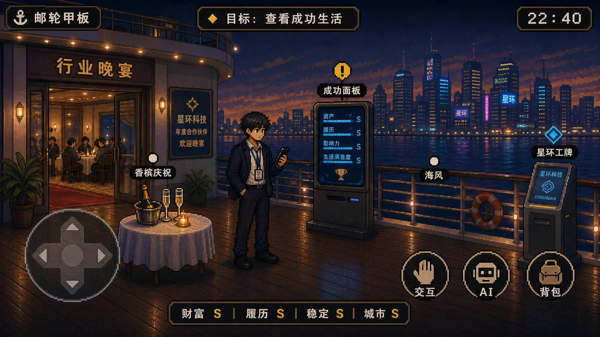
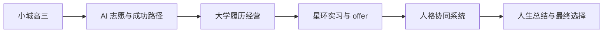
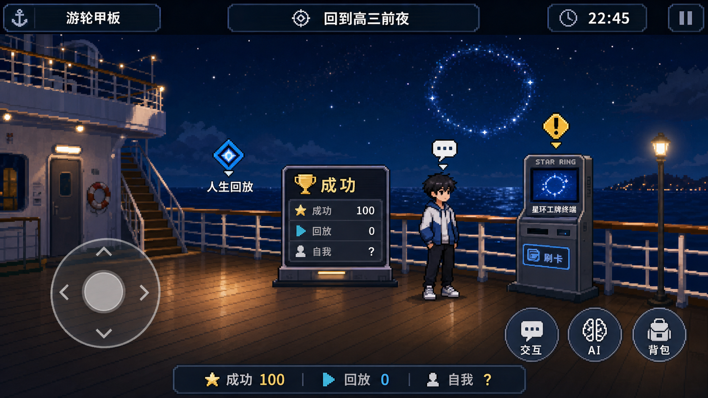
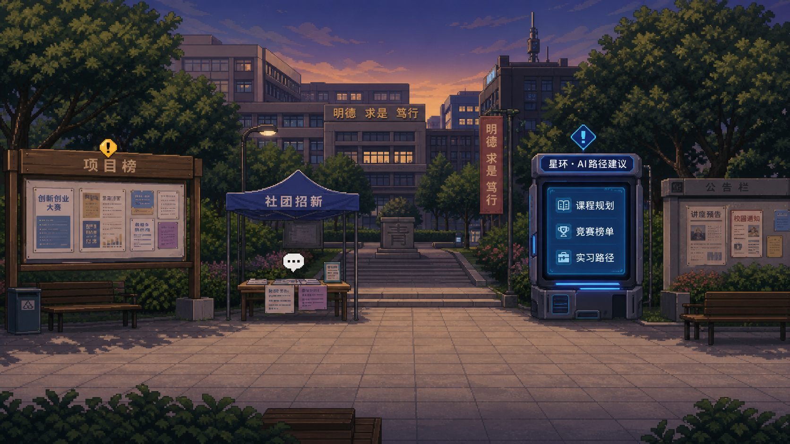
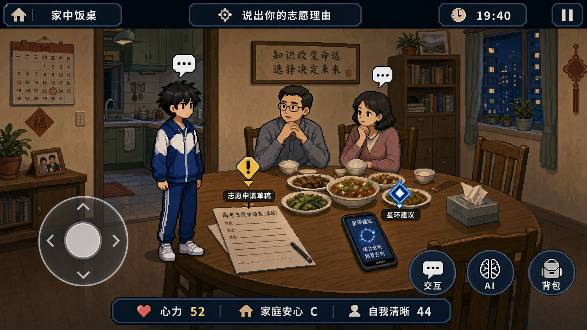
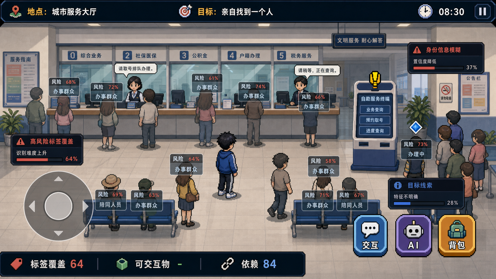
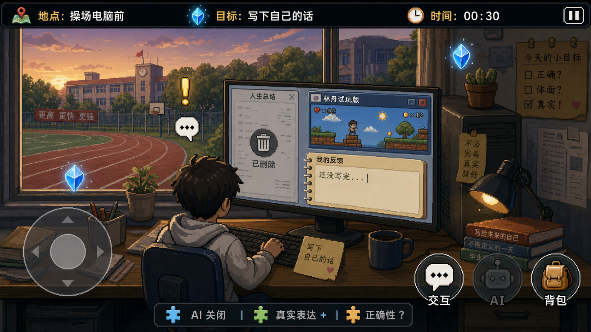

# 《毕业前夜无人回答》游玩文档

## 使用说明

1. 请先创建副本，再基于副本修改使用：创建副本。
2. 每一节内容建议控制在 200 字以内。
3. 能用图表 / 截图表达的内容，请优先使用视觉呈现。
4. 分享链接时请设置为互联网获得链接的人可阅读，避免影响评审。

## 一、项目概览 (一句话说清)

- 项目名称：《毕业前夜无人回答》
- 介绍：一款后 AI 时代前夜的 2D 像素横向 RPG。玩家从星环科技新贵的成功未来回放到小城高三，在志愿、朋友、履历、面试和工作中体验 AI 优化如何帮助人上岸，也如何逐步接管选择。

## 二、为什么做 (Why)

### 1. 受众是谁？

面向 15-30 岁的学生、毕业生、职场新人和互动叙事玩家。他们熟悉高考、志愿、绩点、实习、AI 工具和大厂想象，可能在校园展会、游戏节、AI 创作活动或社交媒体上遇见本作。

### 2. 想为他们创造什么？

我们想创造一种“明明都很合理，却越来越不像自己”的体验。观察一：很多学生填志愿时不是问“我想要什么”，而是问“哪个更稳”。观察二：AI 能把话写得更成熟，但也会让人忘记自己原本想怎么说。

### 3. 现有体验 / 方案还缺什么？

同类 AI 题材常把 AI 写成邪恶反派，或把成功路径写成一眼能看穿的陷阱。本作更关心好用系统的温柔压力：它确实减轻焦虑、提高效率、提供机会，也因此更难被拒绝。

## 三、做了什么 (What)

### 核心设计功能 1

功能名称：人生回放式章节纵切

设计意图 / 解决的问题：先给玩家看见成功终点，再回到高三复盘路径，让“上岸”成为真实诱因，而不是简单反讽。当前 demo 已串起 Chapter 0-8，可从游轮、校园、大学、公司一路走到最终结算。

关键截图 / 流程：

Chapter 0 成功未来 -> Chapter 1 高三志愿 -> Chapter 5 星环 offer -> Chapter 8 人生总结。

### 核心设计功能 2

功能名称：压力遭遇替代战斗

设计意图 / 解决的问题：游戏不打怪，把志愿填报、家长饭桌、毕业留言、项目答辩、面试和需求评审做成回合式压力遭遇。玩家管理准备度、心力、关系支援和 AI 建议，在现实压力里做取舍。

关键截图 / 流程：

探索场景 -> 触发压力遭遇 -> 选择表达 / 稳妥 / AI 优化 -> 结算数值、关系和路径权重。

### 核心设计功能 3

功能名称：AI 优化与朋友关系双轨反馈

设计意图 / 解决的问题：AI 路线短期收益更清晰，但会让朋友消息、兴趣和不成熟表达逐渐被摘要和标签化。朋友不是功能 NPC，而是不同人生路径的镜子，帮助玩家感到“低收益关系”仍然具体。

关键截图 / 流程：

## 四、未来规划 (如果晋级，下一步怎么做)

- 近 3 个月：补齐 Chapter 0-8 可玩细节，完善压力遭遇数值、关键对白、关系反馈、BGM 节奏和截图级 UI 表现。
- 中长期 (1 年内)：制作完整移动端版本，扩展多结局、朋友支线、真实像素资产、存档回放和无障碍阅读体验。
- 商业化或落地设想 (如适用)：先以叙事短篇付费版或展会 demo 落地，再拓展校园 AI 素养工作坊、互动展陈和教育讨论版本。
